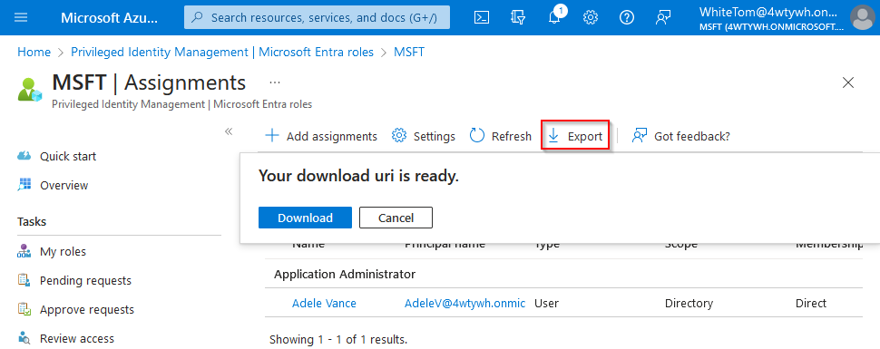

---


---

# What to expect?

- Invisible Eligible Role Assignments in Portal
- Role Assignments that's shouldn't be possible via API

---

# How it all started

<div class="columns">
<div>
<i class="fa-solid fa-person-circle-question fa-10x"></i>
</div>
<div>

> I want to check if only Admin Users have assigned Roles. Therefore, I need a report about all Role Assignments in Azure & EntraID.

 </div>
</div>

---

## Start with Entra ID

<!-- Should be easy enough shouldn't it? Let's start with EntraID -->
<!-- I remember, there is a Button in EntraID -->

<i class="fa-solid fa-lightbulb fa-10x"></i>

Naive Thimo

---


---

### EntraID Export results

| displayName               | roleDisplayName      | directoryScopeId | And More... |
|---------------------------------|----------------------|------------------|-------------|
| WhiteTom | Global Administrator | /                |             |

- <i class="fa-solid fa-check"></i> Looks good!

* <i class="fa-solid fa-pause"></i> Wait! What about PIM?

---

### Privileged Identity Management

- manage, control, and monitor access to important resources
- Allows Eligible assignments, that users can activate when needed


---

### Export again

Who hopes, that it is included?

* <i class="fa-solid fa-xmark"></i> PIM eligible not included
* Are via PIM currently activated Roles included?
  * <i class="fa-solid fa-exclamation"></i> Yes, but without any hint, that it will expire

---

<!-- But we saw another Button, does it work? -->

### Export via PIM


What is included in the export?

---

| State | User Group Name | Role Name                 | Start Time           | End Time             | Member Type | Email                           | PrincipalName                   |
|------------------|-----------------|---------------------------|----------------------|----------------------|-------------|---------------------------------|---------------------------------|
| Eligible         | Adele Vance     | Application Administrator | 2024-01-21 13:05:43Z | Permanent            | Direct      | AdeleV@4wtywh.onmicrosoft.com   | AdeleV@4wtywh.onmicrosoft.com   |
| Active           | Adele Vance   | Application Administrator     | 2024-01-21 14:11:13Z | 2024-01-21 22:11:13Z | Direct      | AdeleV@4wtywh.onmicrosoft.com   | AdeleV@4wtywh.onmicrosoft.com   |
| Active           | WhiteTom        | Global Administrator      |                      | Permanent            | Direct      | WhiteTom@4wtywh.onmicrosoft.com | WhiteTom@4wtywh.onmicrosoft.com |

---

### Summary - fun with Portal

* EntraID Export
  * <i class="fa-solid fa-xmark"></i> Doesn't include PIM Eligible roles
  * &nbsp;<i class="fa-solid fa-exclamation"></i>&nbsp; Contains activated roles (without end date)
* PIM Export
  * <i class="fa-solid fa-check"></i> Includes Active & Eligible Assignments
  * &nbsp; <i class="fa-solid fa-exclamation"></i>&nbsp; Doesn't include transitive group assignments
  * <i class="fa-regular fa-circle-question"></i> Purpose of Member Type
* Who likes GUI?
  * <i class="fa-regular fa-face-angry"></i> I don't!

---

### Application Programming Interface (API)


---

```
https://api.azrbac.mspim.azure.com/api/v2/privilegedAccess/aadroles/
  roleAssignments/export?
    $expand=subject,roleDefinition($expand=resource)&
    $filter=roleDefinition/resource/id eq 'd995bd76-2883-4b4e-8ff4-0c505ec95484'
```

<!-- ResourceID is just the TenantID -->

Anyone knows this API?

* internal API for PIM
* Let's not use that! Alternatives?
* Use `Graph API` instead

---

### Graph APIs

- Everyone seems to use `roleManagement/directory/roleAssignments`
  - *Active* role assignments
- At least some refer to `/roleManagement/directory/roleEligibilityScheduleInstances`
  - *Eligible* role assignments in PIM
- 