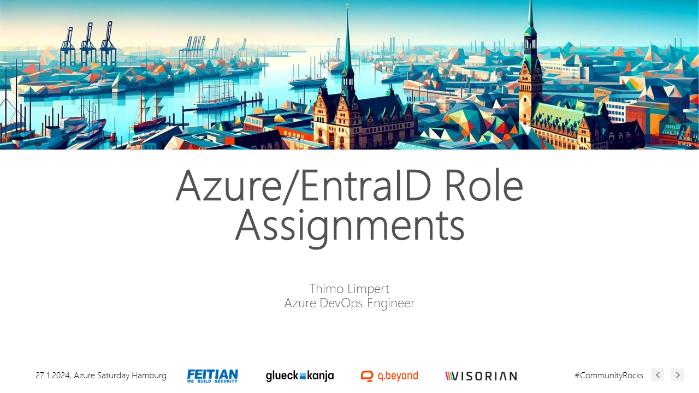
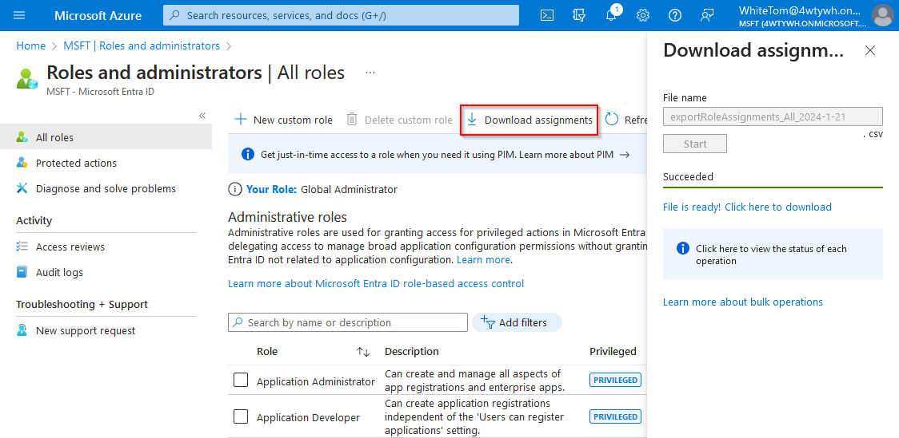
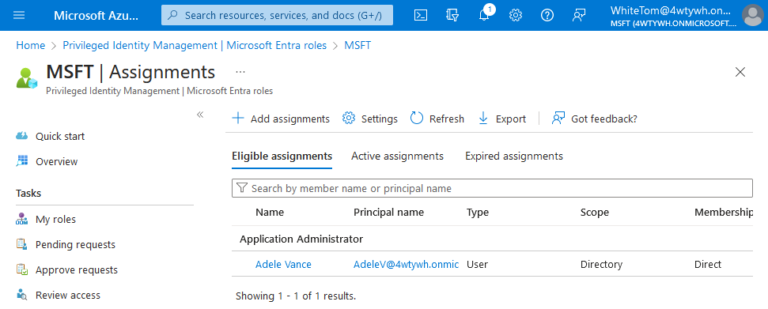
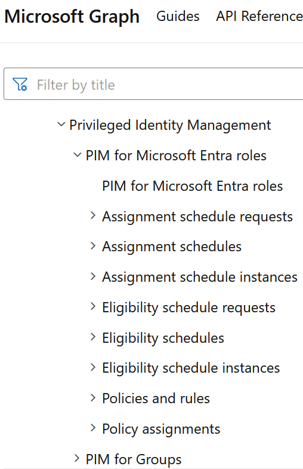
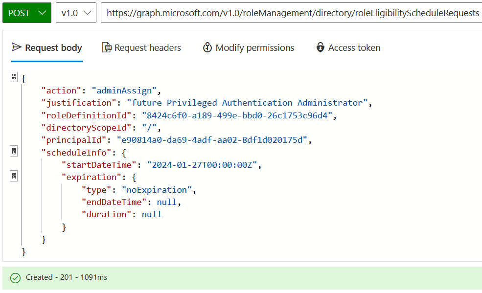
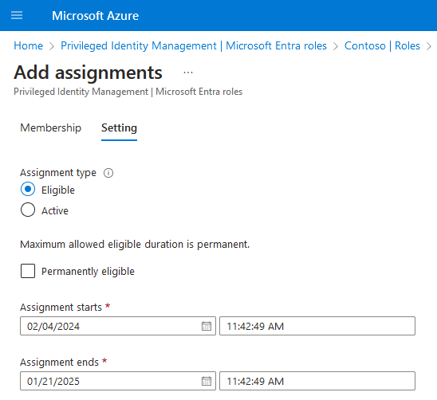
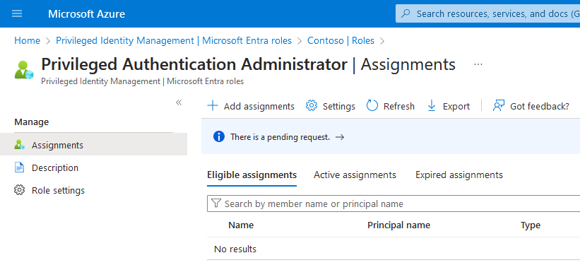
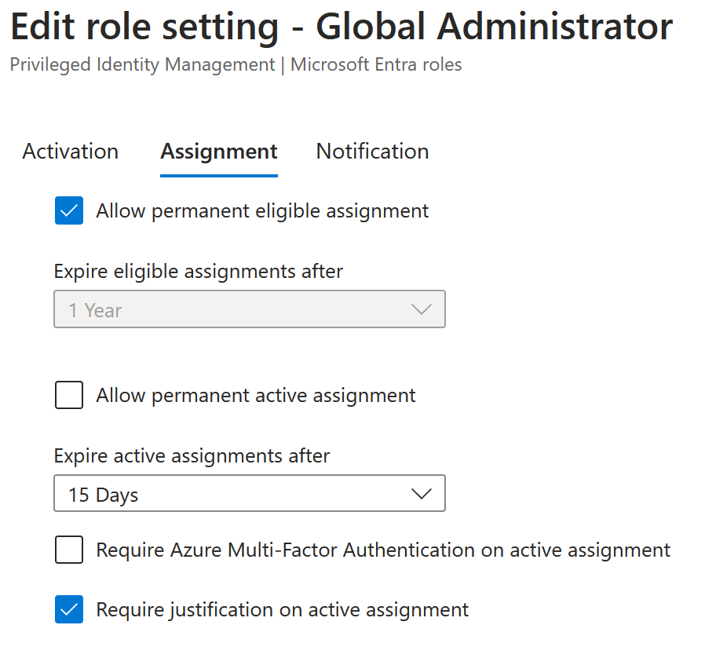
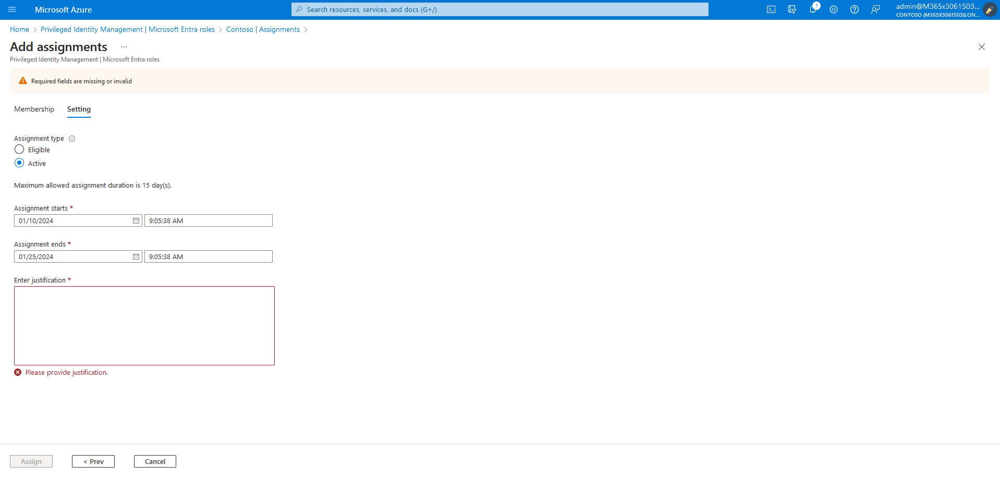
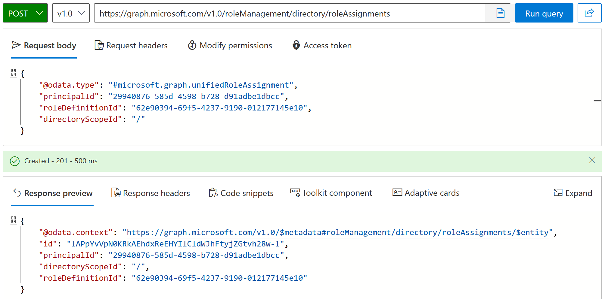

---


---

# What to expect?

- Invisible not yet active Eligible Role Assignments in Portal
- Role Assignments that's shouldn't be possible

---

# How it all started

<div class="columns">
<div>
<i class="fa-solid fa-person-circle-question fa-10x"></i>
</div>
<div>

> I want to check if only Admin Users have assigned Roles. Therefore, I need a report about all Role Assignments in Azure & EntraID.

 </div>
</div>

---

## Start with Entra ID

<!-- Should be easy enough shouldn't it? Let's start with EntraID -->
<!-- I remember, there is a Button in EntraID -->

<i class="fa-solid fa-lightbulb fa-10x"></i>

Naive Thimo

---



---

### Privileged Identity Management

- manage, control, and monitor access to important resources
- Allows Eligible assignments, that users can activate when needed



---

### EntraID Export results

| displayName | roleDisplayName      | directoryScopeId | And More... |
| ----------- | -------------------- | ---------------- | ----------- |
| WhiteTom    | Global Administrator | /                |             |

- <i class="fa-solid fa-check"></i> Looks good!

* <i class="fa-solid fa-pause"></i> Wait! What about PIM?

---

<!-- But we saw another Button, does it work? -->

### Export via PIM


What is included in the export?

---

| State    | User Group Name | Role Name                 | Start Time           | End Time             | Member Type | Email                           | PrincipalName                   |
| -------- | --------------- | ------------------------- | -------------------- | -------------------- | ----------- | ------------------------------- | ------------------------------- |
| Eligible | Adele Vance     | Application Administrator | 2024-01-21 13:05:43Z | Permanent            | Direct      | AdeleV@4wtywh.onmicrosoft.com   | AdeleV@4wtywh.onmicrosoft.com   |
| Active   | Adele Vance     | Application Administrator | 2024-01-21 14:11:13Z | 2024-01-21 22:11:13Z | Direct      | AdeleV@4wtywh.onmicrosoft.com   | AdeleV@4wtywh.onmicrosoft.com   |
| Active   | WhiteTom        | Global Administrator      |                      | Permanent            | Direct      | WhiteTom@4wtywh.onmicrosoft.com | WhiteTom@4wtywh.onmicrosoft.com |

---

<i class="fa-solid fa-computer-mouse fa-10x"></i>

- Who likes to use the Mouse?
  * <i class="fa-regular fa-face-angry"></i> I don't!

---

## Graph APIs

<!-- I'm Lazy-->
<!-- So searched the WWW for other people already done that-->

> Microsoft Graph is a RESTful web API that enables you to access Microsoft Cloud service resources.

* Everyone seems to use `roleManagement/directory/roleAssignments` as *Active* role assignments
* Some refer to `/roleManagement/directory/roleEligibilityScheduleInstances` as *Eligible* role assignments in PIM

---

### Documentation

* `Assignment *`
  * Ignored, we got the other API for that
* [`Eligibility schedule requests`](https://learn.microsoft.com/en-us/graph/api/resources/unifiedroleeligibilityschedulerequest?view=graph-rest-1.0)
  * Represents a request for a role eligibility 
*  [`Eligibility Schedule`](https://learn.microsoft.com/en-us/graph/api/resources/unifiedroleeligibilityschedule?view=graph-rest-1.0) vs. [`Eligibility Schedule Instance`](https://learn.microsoft.com/en-us/graph/api/resources/unifiedroleeligibilityscheduleinstance?view=graph-rest-1.0)



---

#### Eligibility Schedule Instance

> Represents the instance for a role eligibility in your tenant.

* Used by most people in the Internet & Azure Portal
* Outputs all Eligibility visible in Portal
* <i class="fa-regular fa-circle-question"></i> What is *Eligibility Schedule*?

---

#### Eligibility Schedule

> Represents a schedule for a role eligibility in your tenant and is used to instantiate a EligibilityScheduleInstance.

* <i class="fa-regular fa-circle-question"></i> What is the difference?
* `EligibilityScheduleInstance` has Properties `startDateTime`, `endDateTime`, `roleEligibilityScheduleId`
* `EligibilitySchedule` has Property `scheduleInfo` of type `requestSchedule`

---




<!-- But wait, we can assign stuff in the future if not permanent -->
<!-- Even permanent assignment in the future is possible via Graph -->

---

```mermaid
flowchart LR
    EligibilityScheduleRequest -- "Approved" --> EligibilitySchedule
    EligibilitySchedule -- at start Time --> EligibilityScheduleInstance
```

---

### What do we see in Portal/Exports?

* &nbsp; <i class="fa-solid fa-exclamation"></i>&nbsp; Current Eligible Assignments
* <i class="fa-regular fa-face-sad-tear"></i> No Eligible Assignments in the future <i class="fa-regular fa-face-sad-tear"></i>
  * BUT: Microsoft is improving and adding a hint


---

<!-- New Hint in PIM! Many changes in Portal right now -->


---

## PIM Settings

- What happens, when you create a permanent active assignment?


---



---



---

### Summary

- Not all Export Buttons do the same
- Not yet instantiated Eligible assignments ~~neither shown~~, nor exported
  - at least a hint in PIM is there now
- Permanent Active Assignments seem possible although not allowed

---

## Additional Information

---

### Comparison EntraID Export vs PIM Export

* EntraID Export
  * <i class="fa-solid fa-xmark"></i> Doesn't include PIM Eligible roles
  * &nbsp;<i class="fa-solid fa-exclamation"></i>&nbsp; Contains activated roles (without end date)
* PIM Export
  * <i class="fa-solid fa-check"></i> Includes Active & Eligible Assignments
  * &nbsp; <i class="fa-solid fa-exclamation"></i>&nbsp; Doesn't include transitive group assignments
  * <i class="fa-regular fa-circle-question"></i> Purpose of Member Type

---

### API used by Portal Export


---

```
https://api.azrbac.mspim.azure.com/api/v2/privilegedAccess/aadroles/
  roleAssignments/export?
    $expand=subject,roleDefinition($expand=resource)&
    $filter=roleDefinition/resource/id eq 'd995bd76-2883-4b4e-8ff4-0c505ec95484'
```

<!-- ResourceID is just the TenantID -->

Anyone knows this API?

* internal API for PIM
* Let's not use that! Alternatives?
* Use `Graph API` instead